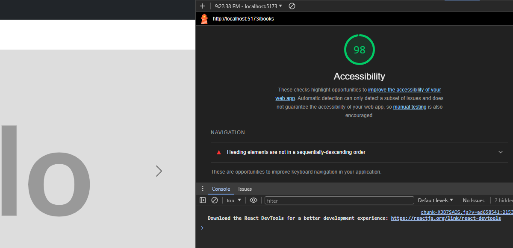

# Can of Books

**Author**: Felix A. Taveras

**Version**: 1.0.0

## Overview

Welcome to the "Can of Books" app, a curated collection of top-notch books spanning various genres. This React application, powered by a Node.js backend using Express and MongoDB via Mongoose, allows users to explore a carefully selected list of books. Each book is presented in a dynamic carousel, showcasing its title, status, and a brief description. Whether you're an avid reader searching for your next literary adventure or simply curious about must-reads, the "Best Books" app has you covered.

### LightHouse



## Getting Started

To get started with the "Can of Books" app, follow these steps:

1. **Clone the Repository:**
   ```bash
   git clone https://github.com/ekowyawson/can-of-books-backend.git
   git clone https://github.com/f-taveras/can-of-books-front-end.git
   ```

2. **Navigate to the Project Directory:**
   ```bash
   # Backend
   cd can-of-books-backend
   #Frontend
   cd can-of-books-frontend
   ```

3. **Install Dependencies:**
   ```bash
   npm install
   ```

4. **Set Up MongoDB:**
   * Ensure you have MongoDB installed and running.
   * Update the MongoDB connection string in `config/db.js` or relevant configuration file.

5. **Run the Application:**
   ```bash
   npm run start
   ```

6. **Explore the "Best Books" App:**
   * Open your browser and go to `http://localhost:3000`.
   * Browse through the carousel to discover details about each book.

## Dependencies

```json
{
    "axios": "^1.6.2",
    "bootstrap": "^5.3.2",
    "dotenv": "^16.3.1",
    "react": "^18.2.0",
    "react-bootstrap": "^2.9.1",
    "react-dom": "^18.2.0",
    "react-router-dom": "^6.15.0"
}
```

## Architecture

The "Can of Books" app follows a client-server architecture:

* **Client-Side (React):**
  * The frontend is built using React, a popular JavaScript library for building user interfaces.
  * React Bootstrap is utilized for styling and UI components, providing a responsive and visually appealing design.
  * Axios is employed for making asynchronous HTTP requests to the server.

* **Server-Side (Node.js and Express):**
  * The backend is powered by Node.js and Express, providing a robust server environment.
  * Mongoose is used as the MongoDB ODM (Object Data Modeling) library to interact with the database.
  * RESTful API endpoints handle book retrieval from the MongoDB database.

* **Database (MongoDB):**
  * MongoDB is chosen as the NoSQL database for storing book information.
  * The `Book` schema defines the structure for each book, including title, description, and status.

This architecture ensures a separation of concerns, with the frontend handling the user interface and the backend managing data storage and retrieval. The collaboration between React, Express, and MongoDB creates a seamless and efficient web application experience for users exploring the "Can of Books."

## Change Log

* **12-11-2023 6:49pm** - Connected the front-end with the back-end

## Credit and Collaborations

* Felix Taveras - Frontend Dev
* Ekow Yawson - Backend Dev

## What can books do?

Books are life-changing. They have the power to enlighten, educate, entertain, heal, and help us grow.

Welcome to the "Best Books" app! Explore a curated collection of top-notch books that cover a variety of genres.
Our handpicked selection includes titles that are sure to captivate readers of all tastes.
Browse through the carousel to discover details about each book, including its title, status, and a brief description.
Whether you're looking for your next literary adventure or simply curious about great reads,
this app is your go-to source for the best books around!

## Logistical

***What hours will you be available to communicate?***

* We will be available to communicate between the hours of 5PM and 9PM.

***What platform will you use to communicate (ie. Slack, phone …)?***

* We will communicate using Slack, Remo, Zoom, and lastly, by phone if necessary.

***How often will you take breaks?***

* We will take ten minute breaks every hour

***What is your plan if you start to fall behind?***

* We do not plan on falling behind, but in the rare chance we do, we decide on a good time for
  both of us to meet before class to maximize time spent on the work.

## Cooperative

* Make a list of each person’s strengths.

**Felix**:

1. Great work ethic.
2. Great with technical processes.
3. Extensive knowledge of Git.
4. Pays great attention to detail.

**Ekow**:

1. Extensive Coding knowledge.
2. Proficient with JavaScript, Node.js, MongoDB, REACT, Python, etc.
3. Great work ethic.
4. Willingness to help others.

How can you best utilize these strengths in the development of your application?

* Both of our experiences and knowledge renders this project easy and will aid us in quickly completing the
  project beyond expectations.

In what areas do you each want to develop greater strength?

* We both need to develop a better understanding of REACT and MongoDB and how to best utilize them
  together to build **MERN** stack applications.

Knowing that every person in your team needs to understand the code, how do you plan to approach the day-to-day development?

* We plan to add descriptive comments and clear/concise language in our code to allow each partner to see exactly what
  the code is doing.

## Conflict Resolution

Building a project collaboratively on GitHub involves effective communication, collaboration, and mutual respect. Here are some strategies to address conflict resolution:

1. **Unequal Contribution:**
   * **Early Communication:** Establish open communication channels from the start. Discuss roles, expectations, and individual strengths.
   * **Regular Check-Ins:** Schedule regular check-ins to discuss progress. If one person is struggling or unable to contribute, address it early to find a solution.
   * **Adjust Roles:** If the workload is imbalanced, be flexible in redistributing tasks based on individual strengths, interests, or availability.

2. **Overbearing Dominance:**
   * **Establish Clear Roles:** Define specific roles and responsibilities at the beginning of the project. This helps prevent one person from taking over all aspects of the project.
   * **Open Discussions:** Encourage open discussions about project decisions. If one person is dominating, address the issue and ensure that decisions are made collaboratively.
   * **Rotate Responsibilities:** Consider rotating responsibilities for different aspects of the project to ensure a more equal distribution of tasks.

3. **Skill and Understanding Levels:**
   * **Embrace Differences:** Acknowledge and embrace the diversity in skill levels and understanding. Everyone brings unique strengths to the team.
   * **Pair Programming:** Consider pair programming, where team members work together on the same code. This facilitates knowledge sharing and helps bridge skill gaps.
   * **Documentation:** Document code, decisions, and processes thoroughly. This helps team members understand each other's work and allows for more efficient collaboration.

In addition to these strategies, maintaining a positive and respectful team culture is crucial. We will regularly revisit and adjust the team's working agreements to ensure they meet everyone's needs.

We are in a learning environment. From any level of expertise, we are all learning, we will act as such  :)
